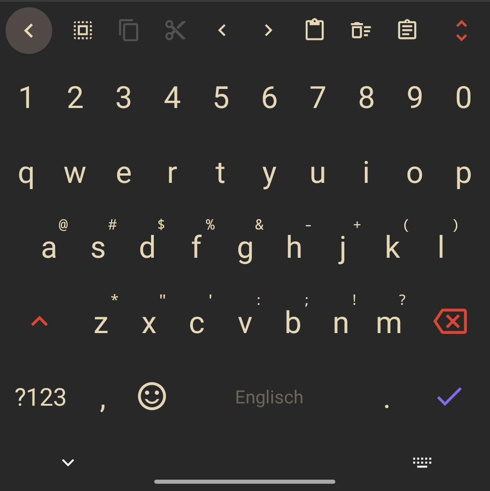

# Methone for [FlorisBoard](https://github.com/florisboard/florisboard)
> A theme for [FlorisBoard](https://github.com/florisboard/florisboard).

## Installation
1. Download the theme .flex. 
2. Open the florisboard.
3. Go to Theme and click Manage installed themes.
4. Select import and then click on Select files.
5. Choose choose the downloaded file, and click Import.
6. After that choose the theme named 'Methone Night'.
7. Under keyboard you can make the remaining adjustments, such as the number row, etc..

## License

[MIT License](./LICENSE)
